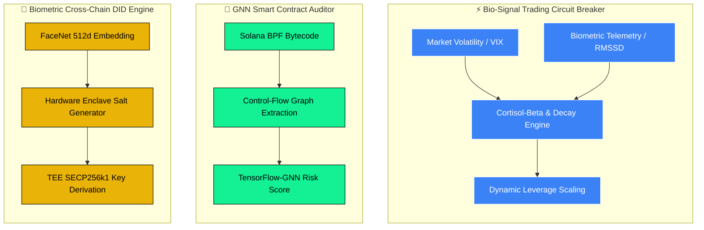

# ⚡ Piyush Kumar | Quant Finance & AI Specialist ⚡

 

<!-- Standalone Centered Visual Banner -->

 

---
## 🚀 <b> ABOUT & RESEARCH FOCUS </b> </h3>

<b> WIPO Patent Holder • Independent Quantitative Researcher </b>

<b>🏥 Healthcare & Household Economics</b>

<blockquote align="left">
<i>"Formulating multi-stakeholder equilibrium models and structural default frameworks, aligning value-based precision capitation incentives while quantifying household financial risks under digital search frictions."</i> 
</blockquote>

<b>📈 Quant Finance & Market Microstructure</b>

<blockquote align="left">
<i>"Translating behavioral observations, such as the 'Experience Effect'—into programmatic circuit breakers that preserve institutional solvency during periods of acute market panic."</i>
</blockquote>
<ul align="left">
<li>🏥 <b>Healthcare & Household Econ</b>: Multi-stakeholder precision capitation equilibrium models, digital rental search mortgage risk indicators, and health capital accumulation dynamics.</li>
<li>🔐 <b>Web3 & Cryptography</b>: TEE-isolated biometric salt generation (<code>WIPO PCT/IB2026/058453</code>), cross-chain $SECP256k1$ key derivation, and TensorFlow-GNN bytecode auditing.</li>
<li>⚡ <b>Quantitative Modeling</b>: Bio-signal risk dampening, physiological stress ($RMSSD$) proxies, and Behavioral Volatility Index ($BVI$) mechanics.</li>
</ul>

---

  
## 🔬 Active Workbench & Current Experiments

- ⚡ **Bio-Signal Circuit Breakers**: Fine-tuning $RMSSD$ physiological stress thresholds against high-frequency crypto market crashes to automate leverage dampening ($10\times \rightarrow 1\times$).
- 🛡️ **BPF Bytecode Risk Scoring**: Extracting directed control-flow graphs (CFGs) from compiled Rust/Solana binaries for real-time TensorFlow-GNN vulnerability detection.
- 📈 **Microstructure & Experience Effect**: Calibrating smooth-decay exponential functions that map historical economic traumas against real-time order flow volatility.

---

## ⚙️ Multi-Disciplinary System Flow

---

## 📊 Benchmarks & System Metrics

| Research Pillar | Key Metric / Metric Indicator | Execution / Proof-of-Concept |
| :--- | :--- | :--- |
| **Biometric Cross-Chain DID** | $D_{\text{cosine}} < 0.60$ | CLAHE + 512-d FaceNet vector extraction in isolated TEE enclaves |
| **Biological Circuit Breaker** | `Avg Coupling: 0.03` (Orthogonal Signal) | Proven independence between bio-stress indicators & market volatility |
| **Behavioral Volatility (BVI)** | `Extended Solvency Runway` | Dynamic fee adjustment backtested against 2022 Terra-Luna collapse |
| **Smart Contract Auditor** | `Instant Binary-to-Graph Approval` | Raw machine code parsing into NetworkX directed logic graphs |
| **Behavioral Microstructure** | `Smooth-Decay Risk Mapping` | Dynamic hedge ratio calibration matching order flow volatility against "Experience Effect" biases |

---

## 📦Production Repositories & Research Codebases

- 🧬 [**`hormone-responsive-smart-portfolio`**](https://github.com/pikum06/hormone-responsive-smart-portfolio): Interactive visual analytics & backtest suite quantifying bio-signal-driven portfolio risk management.
- 🔐 [**`biometric-did-engine`**](https://github.com/pikum06/biometric-did-engine): Hardware Enclave biometric salt generator & risk-adaptive cross-chain identity engine (WIPO PCT/IB2026/058453).
- 🤖 [**`gnn-smart-contract-auditor-demo`**](https://github.com/pikum06/gnn-smart-contract-auditor-demo): TensorFlow-GNN pipeline auditing compiled Solana BPF bytecode for instant safety approvals.
- 📉 [**`risk-adaptive-stablecoin-bvi-demo`**](https://github.com/pikum06/risk-adaptive-stablecoin-bvi-demo): Behavioral Volatility Index ($BVI$) framework modeling protocol solvency during extreme market drawdowns.
- 📊 [**`behavioral-microstructure-matching-engine-demo`**](https://github.com/pikum06/behavioral-microstructure-matching-engine-demo): Analytical framework and visual execution suite evaluating high-frequency market microstructure, limit order book matching matrices, and behavioral liquidity dynamics.

---

## 🛠️ Tools & Technologies

<table width="100%">
  <thead>
    <tr>
      <th align="center">Domain</th>
      <th align="center">Technologies & Infrastructure</th>
    </tr>
  </thead>
  <tbody>
    <tr>
      <td align="left"><b>Languages&nbsp;&&nbsp;Core&nbsp;Systems</b></td>
      <td align="center">
         &nbsp;&nbsp;
         &nbsp;&nbsp;
         &nbsp;&nbsp;
        
      </td>
    </tr>
    <tr>
      <td align="left"><b>AI,&nbsp;ML&nbsp;&&nbsp;Econometrics</b></td>
      <td align="center">
         &nbsp;&nbsp;
         &nbsp;&nbsp;
         &nbsp;&nbsp;
         &nbsp;&nbsp;
        
      </td>
    </tr>
    <tr>
      <td align="left"><b>Blockchain&nbsp;&&nbsp;Web3</b></td>
      <td align="center">
         &nbsp;&nbsp;
        
      </td>
    </tr>
    <tr>
      <td align="left"><b>Analytics&nbsp;&&nbsp;Dev&nbsp;Tools</b></td>
      <td align="center">
         &nbsp;&nbsp;
         &nbsp;&nbsp;
         &nbsp;&nbsp;
        
      </td>
    </tr>
  </tbody>
</table>

---

## 📊 GitHub Streak Telemetry

 <table>
  <tr>
    <td width="50%" align="center">
      
    </td>
    <td width="50%" align="center">
      
    </td>
  </tr>
</table>

---
