# ⚡ Piyush Kumar | Quant Finance & AI Specialist ⚡

<table>
  <tr>
    <td width="60%" valign="top">
      <h3 align="left">🚀 About & Research Focus</h3>
      
<b>Quant Finance & AI Specialist • WIPO Patent Holder • Applied Cryptographer</b>

      <blockquote align="left">
        <i>"Translating empirical behavioral observations—such as the 'Experience Effect'—into programmatic circuit breakers that preserve institutional solvency during periods of acute market panic."</i>
      </blockquote>
      <ul align="left">
        <li>⚡ <b>Quantitative Modeling</b>: Bio-signal risk dampening, physiological stress ($RMSSD$) proxies, and Behavioral Volatility Index ($BVI$) mechanics.</li>
        <li>🔐 <b>Web3 & Cryptography</b>: TEE-isolated biometric salt generation (<code>WIPO PCT/IB2026/058453</code>), cross-chain $SECP256k1$ key derivation, and TensorFlow-GNN bytecode auditing.</li>
        <li>🎓 <b>Education</b>: Dual Degree in B.Tech (Hons.) Computer Science & MBA in Finance.</li>
      </ul>
    </td>
    <td width="40%" align="center" valign="middle">
      
    </td>
  </tr>
</table>

---

### 📊 GitHub Streak Telemetry

  

---

### 🔬 Active Workbench & Current Experiments

- ⚡ **Bio-Signal Circuit Breakers**: Fine-tuning $RMSSD$ physiological stress thresholds against high-frequency crypto market crashes to automate leverage dampening ($10\times \rightarrow 1\times$).
- 🛡️ **BPF Bytecode Risk Scoring**: Extracting directed control-flow graphs (CFGs) from compiled Rust/Solana binaries for real-time TensorFlow-GNN vulnerability detection.
- 📈 **Microstructure & Experience Effect**: Calibrating smooth-decay exponential functions that map historical economic traumas against real-time order flow volatility.

---

### ⚙️ Multi-Disciplinary System Flow

```mermaid
graph LR
    subgraph Telemetry ["1. Telemetry Ingestion"]
        A1[Biometric Telemetry / RMSSD]
        A2[Market Volatility / VIX]
    end

    subgraph Engines ["2. Quantitative Processing"]
        B1[Cortisol-Beta Correlation]
        B2[GNN Bytecode Auditor]
        B3[Behavioral Decay Engine]
    end

    subgraph Execution ["3. Solvency & Risk Control"]
        C1[Dynamic Leverage Scaling]
        C2[TEE Enclave Key Derivation]
        C3[Streamlit Analytics Control]
    end

    Telemetry --> Engines --> Execution

    style B1 fill:#7b2cbf,stroke:#fff,color:#fff
    style C1 fill:#14f195,stroke:#000,color:#000
    style C3 fill:#ff4b4b,stroke:#fff,color:#fff
```

---

### ⚙️Tools & Technologies  

**Languages & Core Systems**

 
 
    
 &nbsp;&nbsp;
 &nbsp;&nbsp;
 &nbsp;&nbsp;

   

**AI, Machine Learning & Computer Vision**

  
 
    
 &nbsp;&nbsp;
 &nbsp;&nbsp;

   

**Blockchain & Decentralized Web3**

  
 
 &nbsp;&nbsp;

   

**Data Engineering, Analytics & Developer Tools**

 
 
 &nbsp;&nbsp;
 &nbsp;&nbsp;
 &nbsp;&nbsp;
 &nbsp;&nbsp;
 &nbsp;&nbsp;

  

---

### 📊 Benchmarks & System Metrics

| Research Pillar | Key Metric / Metric Indicator | Execution / Proof-of-Concept |
| :--- | :--- | :--- |
| **Biological Circuit Breaker** | `Avg Coupling: 0.03` (Orthogonal Signal) | Proven independence between bio-stress indicators & market volatility |
| **Biometric Cross-Chain DID** | $D_{\text{cosine}} < 0.60$ | CLAHE + 512-d FaceNet vector extraction in isolated TEE enclaves |
| **Behavioral Volatility (BVI)** | `Extended Solvency Runway` | Dynamic fee adjustment backtested against 2022 Terra-Luna collapse |
| **Smart Contract Auditor** | `Instant Binary-to-Graph Approval` | Raw machine code parsing into NetworkX directed logic graphs |

---

### 📦Production Repositories & Research Codebases

- 🧬 [**`hormone-responsive-smart-portfolio`**](https://github.com/pikum06/hormone-responsive-smart-portfolio): Interactive visual analytics & backtest suite quantifying bio-signal-driven portfolio risk management.
- 🔐 [**`biometric-did-engine`**](https://github.com/pikum06/biometric-did-engine): Hardware Enclave biometric salt generator & risk-adaptive cross-chain identity engine (WIPO PCT/IB2026/058453).
- 🤖 [**`gnn-smart-contract-auditor-demo`**](https://github.com/pikum06/gnn-smart-contract-auditor-demo): TensorFlow-GNN pipeline auditing compiled Solana BPF bytecode for instant safety approvals.
- 📉 [**`risk-adaptive-stablecoin-bvi-demo`**](https://github.com/pikum06/risk-adaptive-stablecoin-bvi-demo): Behavioral Volatility Index ($BVI$) framework modeling protocol solvency during extreme market drawdowns.
- 📊 [**`behavioral-microstructure-matching-engine-demo`**](https://github.com/pikum06/behavioral-microstructure-matching-engine-demo): Analytical framework and visual execution suite evaluating high-frequency market microstructure, limit order book matching matrices, and behavioral liquidity dynamics.
---

### 📬 Academic & Professional Links

          
